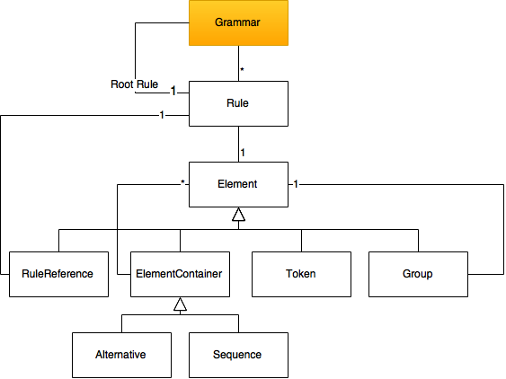

# NTSpeechTools 
[](https://github.com/Carthage/Carthage) [](https://raw.githubusercontent.com/Carthage/Carthage/master/LICENSE.md)   


**NTSpeechTools** is a Objective-C Library providing tools for working with speech recognition on iOS and OSX.

## Features
* Pronunciation Dictionary
* Datastructures to dynamically work on grammars
* Parse and serialize [JSGF](http://www.w3.org/TR/jsgf/#16562) 

## How to get started
* Install
 * Manually
 * Carthage
* Import

```objc
@import NTSpeechTools;
// or
#import <NTSpeechTools/NTSpeechTools.h>
```

## Grammar Datastructure


## Usage

### Phonetic Dictionary
```objc
// Create a dictionary
NTPronunciationDictionary* dic = [NTPronunciationDictionary new];

// Add single word
[dic addWord:@"Flight" phones:@"F L AY T"];

// Add words from dictionary
[dic addWords:@{
    @"Flight" : @[ @"F L AY T", @"F L eY T" ],
    @"AC" : @[ @"EY S IY" ]
}];

//Get pronunciations for a word
NSArray* phoneList = [dic phonesForWord:@"flight"];
```

### Grammar

The grammar we want to create:
```
#JSGF V1.0;

grammar politeness;

// Body
public <startPolite> = (please | kindly | could you | oh  mighty  computer) *;
<endPolite> = [ please | thanks | thank you ];
```

```objc
// CREATE ALTERNATE LIST
NTSpeechGrammarAlternative* startPoliteAlternative = [NTSpeechGrammarAlternative alternativeWithElements:@[
  @"please",
  @"kindly",
  [NTSpeechGrammarSequence sequenceWithTokens:@[ @"could", @"you" ]],
  [NTSpeechGrammarSequence sequenceWithTokens:@[ @"oh", @"mighty", @"computer" ]]
]];

// CREATE GROUP AND SET REPETITION
NTSpeechGrammarGroup* startPoliteGroup = [NTSpeechGrammarGroup groupWithRoot:startPoliteAlternative];
startPoliteGroup.repeatMode = REPEAT_ZERO_OR_MORE;

// CREATE RULE
NTSpeechGrammarRule* startPoliteRule = [NTSpeechGrammarRule publicRuleWithName:@"startPolite" root:startPoliteGroup];

// CREATE ALTERNATE LIST
NTSpeechGrammarAlternative* endPoliteAlternative = [NTSpeechGrammarAlternative alternativeWithElements:@[
  @"please",
  @"thanks",
  [NTSpeechGrammarSequence sequenceWithTokens:@[ @"thank", @"you" ]]
]];

// CREATE RULE WITH OPTIONAL GROUP
NTSpeechGrammarRule* endPoliteRule = [NTSpeechGrammarRule ruleWithName:@"endPolite" root:[NTSpeechGrammarGroup optionalGroupWithRoot:endPoliteAlternative]];

// CREATE GRAMMAR
NTSpeechGrammar* grammar = [NTSpeechGrammar grammarWithName:@"politeness"];
grammar.version = @"V1.0";

// ADD RULES
[grammar addRule:startPoliteRule];
[grammar addRule:endPoliteRule];
```


### JSGF

```objc
// Parse from jsgf file
NTSpeechGrammar* grammar = [NTJsgfGrammar grammarFromFileAtPath:@"/path/to/grammar.jsgf"];

// Parse from string
NTSpeechGrammar* grammar = [NTJsgfGrammar grammarFromString:@"#JSGF V1.0; ........"];

// Serialize to a jsgf file
BOOL success = [NTJsgfGrammar writeGrammar:grammar toFileAtPath:@"/path/to/grammar.jsgf"];

// Serialize to string
NSString *serialized = [NTJsgfGrammar serializeGrammar:grammar];
```
